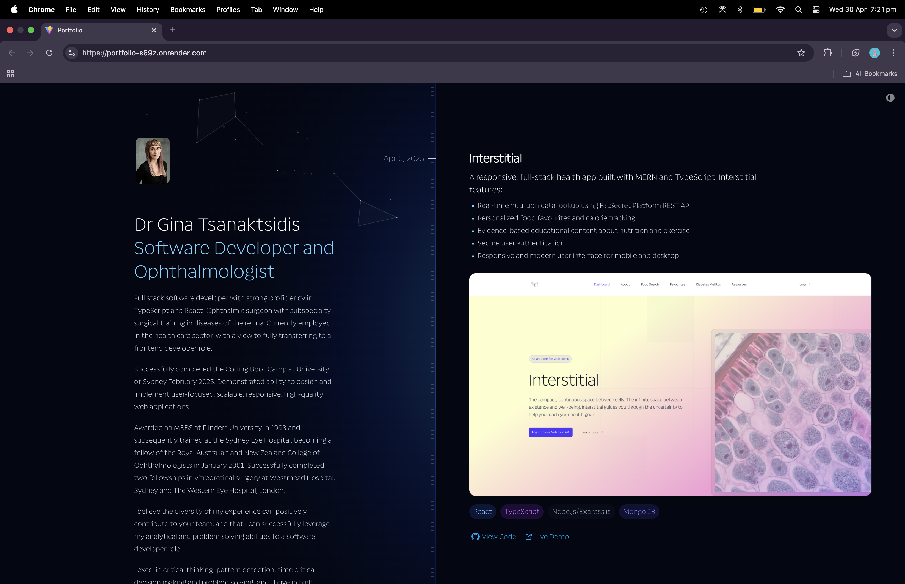
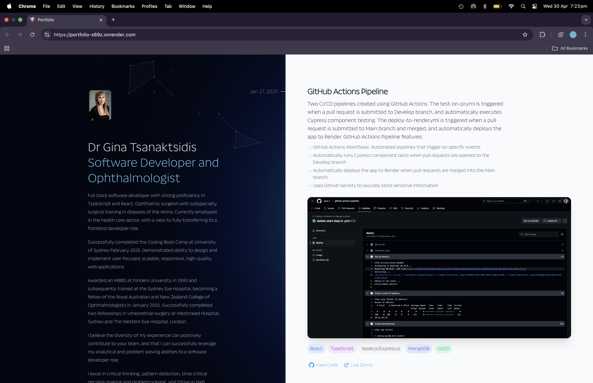

# Portfolio

## Table of Contents

- [Description](#description)
- [Technologies Used](#technologies-used)
- [Features](#features)
- [Installation](#installation)
- [Usage](#usage)
- [License](#license)
- [Contributing Guidelines](#contributing-guidelines)
- [Testing](#testing)
- [Authors and Acknowledgements](#authors-and-acknowledgements)
- [Questions](#questions)

## Description

A responsive full-stack portfolio application built with MERN stack and TypeScript that showcases my software development projects and professional background. This portfolio demonstrates both my frontend design skills and backend development capabilities.

## Technologies Used

- Frontend: Vite, React, TypeScript, Tailwind CSS, gsap, @gasap/react
- Backend: Node.js, Express, MongoDB
- Authentication: JWT
- Deployment: Render

## Features

- Dark/light mode toggle for optimal viewing experience
- Responsive design that works on mobile, tablet, and desktop
- Interactive project gallery with detailed descriptions
- Secure user authentication for resume access
- Contact form for professional inquiries
- Timeline navigation for chronological content browsing


### GSAP Animation Features

- Smooth scroll-triggered animations that enhance user engagement
- Element transitions using GSAP's timeline functionality
- Text revelations that create dynamic content appearance
- Interactive hover animations on project cards
- Performance-optimized animations using GSAP's best practices
- Custom easing functions for natural motion effects
- Seamless dark/light mode transition animations

## Installation

To get started with this project, implement the following steps:

1. Clone the project:

```
git clone git@github.com:gina-t/Portfolio.git
```

2. Install `client` dependancies:

```
cd client
npm install
```

3. Install `server` dependencies:

```
cd server
npm install
```

4. Specifically, this project uses GSAP for animation. Register and login to GSAP and watch the tutorial for useGSAP()Hook. Import the useGSAP() hook from @gsap/react. useGSAP() is a drop-in replacement for useEffect() or useLayoutEffect() that automatically handles cleanup using gsap.context().

```
npm install gsap @gsap/react
```

5. After installation, you can start the development server:

```zsh
# Start backend development server
npm run dev:server

# Start frontend development server in another terminal
npm run dev:client

# Or run both concurrently
npm run dev
```

6. Create separate .env.development and .env.production files in `server` directory:

```plaintext
PORT=
MONGODB_URI=
JWT_SECRET=
NODE_ENV=
LOG_LEVEL=
```

7. In `.env.production`, add your MongoDB Atlas connection string to `MONGO_DB_URI`.

8. In `server` directory generate two secret tokens for JWT and paste into JWT_SECRET fields, one for each environment:

```zsh
# For development token
node -e "console.log('DEV_TOKEN: ' + require('crypto').randomBytes(64).toString('hex'))"

# For production token
node -e "console.log('PROD_TOKEN: ' + require('crypto').randomBytes(64).toString('hex'))"
```

9. In `server` directory:

```zsh
npm run build
npm run start
```

## Usage

Link to deployed app url:

[portfolio](https://portfolio-s69z.onrender.com/)

Screenshots of app demonstrating functionality:

### screenshot-1



### screenshot-2



## License

[](https://opensource.org/licenses/MIT)

## Contributing Guidelines

While this is primarily a personal portfolio project, contributions are welcome:

1. Fork the repository
2. Create a feature branch (`git checkout -b feature/improvement`)
3. Commit your changes (`git commit -m 'Add this feature'`)
4. Push to the branch (`git push origin feature/improvement`)
5. Open a Pull Request

## Testing

Component testing can be performed using Cypress.

To install and run tests:

```zsh
npm install --save-dev cypress
npx cypress open
```

## Authors and Acknowledgements

- **Dr. Gina Tsanaktsidis** - Full Stack Developer and Ophthalmologist
- Email: [ginadrcoder@gmail.com](mailto:ginadrcoder@gmail.com)

Special thanks to The University of Sydney Coding Boot Camp for their excellent curriculum and support.

## Questions

For enquiries, please contact me at:

- Email: [ginadrcoder@gmail.com](mailto:ginadrcoder@gmail.com)

- GitHub: [gina-t](https://github.com/gina-t)
